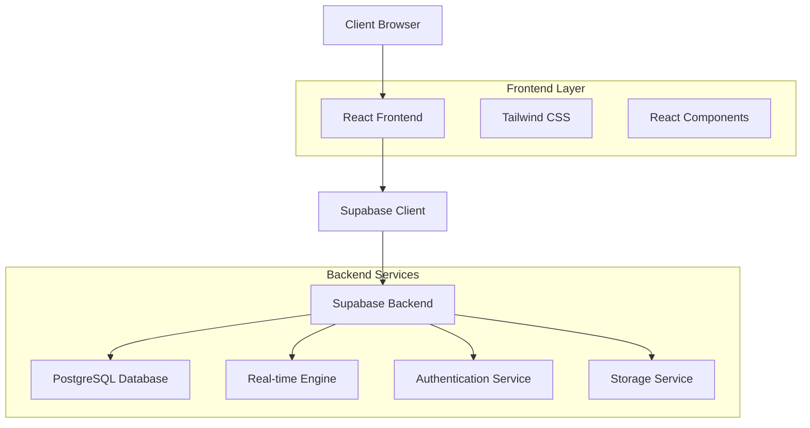
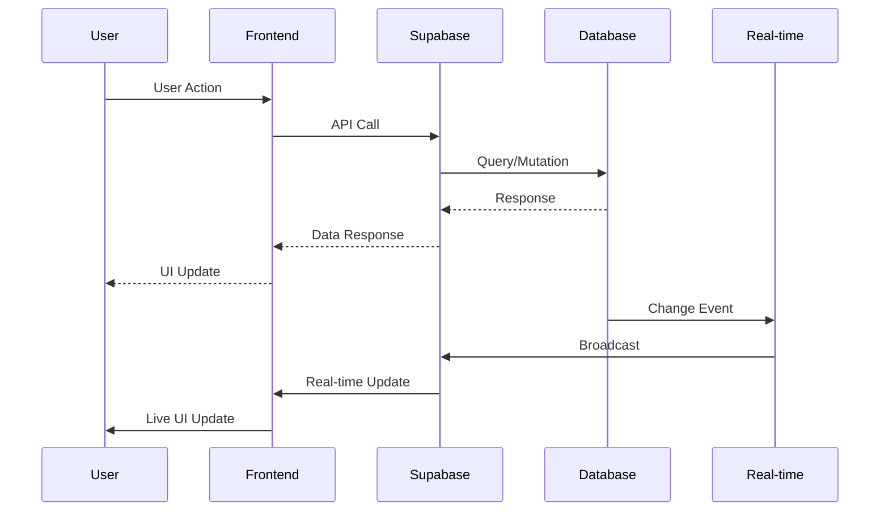

# Design Document

## Overview

The Sovereign Command Center is a React-based collaborative portal built on Supabase that enables bidirectional project management between service providers and clients. The system leverages real-time subscriptions, row-level security, and a responsive design to create a seamless collaborative experience.

The architecture follows a frontend-first approach with Supabase handling authentication, database operations, and real-time synchronization. The design emphasizes security, performance, and user experience while maintaining the existing tech stack of React, Tailwind CSS, and Supabase.

## Architecture

### High-Level Architecture



### Data Flow Architecture



## Components and Interfaces

### Core Components

#### 1. Authentication System
- **LoginForm**: Handles user authentication with email/password
- **RegistrationForm**: New user registration with email verification
- **SessionManager**: Manages user sessions and authentication state
- **ProtectedRoute**: Wrapper component for authenticated routes

#### 2. Project Management
- **ProjectDashboard**: Central hub displaying all user projects
- **ProjectCard**: Individual project display with status and actions
- **ProjectCreator**: Form component for creating new projects
- **ProjectDetails**: Detailed view of individual projects

#### 3. Document Management
- **DocumentUploader**: Drag-and-drop file upload interface
- **DocumentViewer**: Preview component for various file types
- **DocumentList**: Grid/list view of project documents
- **DocumentPermissions**: Access control interface

#### 4. Communication System
- **MessageCenter**: Real-time messaging interface
- **MessageThread**: Individual conversation threads
- **StatusUpdater**: Component for posting project updates
- **NotificationCenter**: Real-time notification display

#### 5. User Management
- **UserInviter**: Interface for adding users to projects
- **RoleManager**: Component for managing user permissions
- **UserList**: Display of project team members

### Interface Specifications

#### Project Interface
```typescript
interface Project {
  id: string;
  name: string;
  description?: string;
  status: 'active' | 'completed' | 'on_hold' | 'cancelled';
  created_at: string;
  updated_at: string;
  owner_id: string;
}
```

#### Document Interface
```typescript
interface Document {
  id: string;
  name: string;
  file_path: string;
  file_size: number;
  mime_type: string;
  project_id: string;
  uploaded_by: string;
  created_at: string;
  is_public: boolean;
}
```

#### Message Interface
```typescript
interface Message {
  id: string;
  content: string;
  project_id: string;
  sender_id: string;
  message_type: 'text' | 'status_update' | 'system';
  created_at: string;
  read_by: string[];
}
```

#### User Role Interface
```typescript
interface ProjectUser {
  id: string;
  project_id: string;
  user_id: string;
  role: 'owner' | 'editor' | 'viewer';
  invited_at: string;
  accepted_at?: string;
}
```

## Data Models

### Database Schema

#### Users Table (Supabase Auth)
- Managed by Supabase Auth service
- Extended with user profiles table for additional metadata

#### Projects Table
```sql
CREATE TABLE projects (
  id UUID PRIMARY KEY DEFAULT gen_random_uuid(),
  name VARCHAR(255) NOT NULL,
  description TEXT,
  status VARCHAR(50) DEFAULT 'active',
  owner_id UUID REFERENCES auth.users(id) ON DELETE CASCADE,
  created_at TIMESTAMP WITH TIME ZONE DEFAULT NOW(),
  updated_at TIMESTAMP WITH TIME ZONE DEFAULT NOW()
);
```

#### Project Users Table
```sql
CREATE TABLE project_users (
  id UUID PRIMARY KEY DEFAULT gen_random_uuid(),
  project_id UUID REFERENCES projects(id) ON DELETE CASCADE,
  user_id UUID REFERENCES auth.users(id) ON DELETE CASCADE,
  role VARCHAR(50) DEFAULT 'viewer',
  invited_at TIMESTAMP WITH TIME ZONE DEFAULT NOW(),
  accepted_at TIMESTAMP WITH TIME ZONE,
  UNIQUE(project_id, user_id)
);
```

#### Documents Table
```sql
CREATE TABLE documents (
  id UUID PRIMARY KEY DEFAULT gen_random_uuid(),
  name VARCHAR(255) NOT NULL,
  file_path VARCHAR(500) NOT NULL,
  file_size BIGINT,
  mime_type VARCHAR(100),
  project_id UUID REFERENCES projects(id) ON DELETE CASCADE,
  uploaded_by UUID REFERENCES auth.users(id) ON DELETE SET NULL,
  created_at TIMESTAMP WITH TIME ZONE DEFAULT NOW(),
  is_public BOOLEAN DEFAULT false
);
```

#### Messages Table
```sql
CREATE TABLE messages (
  id UUID PRIMARY KEY DEFAULT gen_random_uuid(),
  content TEXT NOT NULL,
  project_id UUID REFERENCES projects(id) ON DELETE CASCADE,
  sender_id UUID REFERENCES auth.users(id) ON DELETE SET NULL,
  message_type VARCHAR(50) DEFAULT 'text',
  created_at TIMESTAMP WITH TIME ZONE DEFAULT NOW(),
  read_by UUID[] DEFAULT '{}'
);
```

### Row-Level Security Policies

#### Projects RLS
```sql
-- Users can only see projects they own or are members of
CREATE POLICY "Users can view their projects" ON projects
  FOR SELECT USING (
    owner_id = auth.uid() OR 
    id IN (SELECT project_id FROM project_users WHERE user_id = auth.uid())
  );

-- Only project owners can update projects
CREATE POLICY "Owners can update projects" ON projects
  FOR UPDATE USING (owner_id = auth.uid());
```

#### Documents RLS
```sql
-- Users can view documents from projects they have access to
CREATE POLICY "Users can view project documents" ON documents
  FOR SELECT USING (
    project_id IN (
      SELECT id FROM projects WHERE 
      owner_id = auth.uid() OR 
      id IN (SELECT project_id FROM project_users WHERE user_id = auth.uid())
    )
  );
```

## Error Handling

### Error Categories

#### 1. Authentication Errors
- Invalid credentials
- Session expiration
- Email verification required
- Account locked/suspended

#### 2. Authorization Errors
- Insufficient permissions
- Resource access denied
- Role-based restrictions

#### 3. Network Errors
- Connection timeouts
- Offline scenarios
- API rate limiting
- Server unavailability

#### 4. Validation Errors
- Invalid file types
- File size limits
- Required field validation
- Data format errors

### Error Handling Strategy

#### Frontend Error Handling
```javascript
const ErrorBoundary = ({ children }) => {
  const [hasError, setHasError] = React.useState(false);
  const [error, setError] = React.useState(null);

  React.useEffect(() => {
    const handleError = (error) => {
      setHasError(true);
      setError(error);
      // Log to monitoring service
      console.error('Application Error:', error);
    };

    window.addEventListener('error', handleError);
    return () => window.removeEventListener('error', handleError);
  }, []);

  if (hasError) {
    return <ErrorFallback error={error} />;
  }

  return children;
};
```

#### API Error Handling
```javascript
const handleApiError = (error) => {
  switch (error.code) {
    case 'PGRST301':
      return 'Access denied. Please check your permissions.';
    case 'PGRST116':
      return 'Resource not found.';
    case '23505':
      return 'This item already exists.';
    default:
      return 'An unexpected error occurred. Please try again.';
  }
};
```

## Testing Strategy

### Unit Testing
- Component testing with React Testing Library
- Hook testing for custom React hooks
- Utility function testing
- Mock Supabase client for isolated testing

### Integration Testing
- API integration tests with Supabase
- Authentication flow testing
- Real-time subscription testing
- File upload/download testing

### End-to-End Testing
- User journey testing from login to project completion
- Cross-browser compatibility testing
- Mobile responsiveness testing
- Performance testing under load

### Test Structure
```javascript
// Component Test Example
describe('ProjectDashboard', () => {
  beforeEach(() => {
    // Setup mock Supabase client
    mockSupabase.from.mockReturnValue({
      select: jest.fn().mockResolvedValue({ data: mockProjects, error: null })
    });
  });

  test('displays user projects', async () => {
    render(<ProjectDashboard />);
    
    await waitFor(() => {
      expect(screen.getByText('Project 1')).toBeInTheDocument();
    });
  });

  test('handles project creation', async () => {
    render(<ProjectDashboard />);
    
    const createButton = screen.getByText('Create Project');
    fireEvent.click(createButton);
    
    // Test project creation flow
  });
});
```

### Performance Testing
- Load testing with multiple concurrent users
- Real-time subscription performance under high message volume
- File upload performance with large files
- Database query optimization testing

### Security Testing
- Row-level security policy validation
- Authentication bypass attempts
- SQL injection prevention
- File upload security (malicious files)
- Cross-site scripting (XSS) prevention

## Technical Considerations

### Performance Optimization
- Implement React.memo for expensive components
- Use React.useMemo for expensive calculations
- Lazy loading for document previews
- Pagination for large data sets
- Debounced search and filtering

### Accessibility
- ARIA labels for all interactive elements
- Keyboard navigation support
- Screen reader compatibility
- High contrast mode support
- Focus management for modals and forms

### Mobile Responsiveness
- Touch-friendly interface elements
- Responsive grid layouts
- Mobile-optimized file upload
- Swipe gestures for navigation
- Offline capability with service workers

### Browser Compatibility
- Support for modern browsers (Chrome, Firefox, Safari, Edge)
- Progressive enhancement for older browsers
- Polyfills for missing features
- Graceful degradation for unsupported features